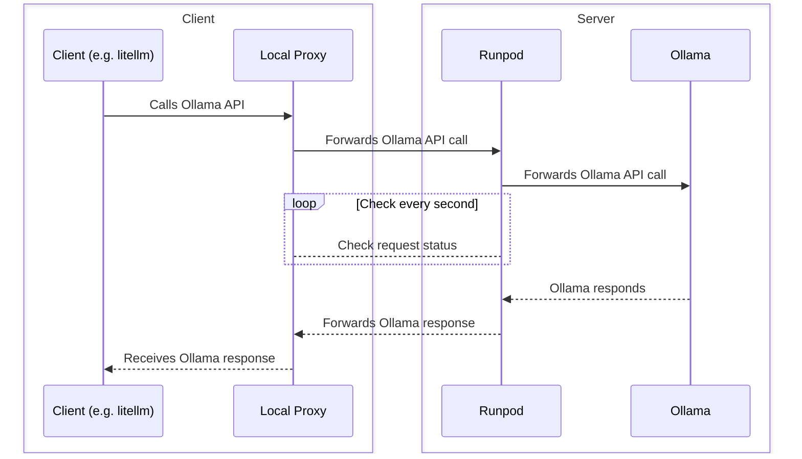

# RunPod Ollama Integration

This project provides a simple way to interact with Ollama models through RunPod's serverless infrastructure.

## Setup

1. Deploy the server code to RunPod
2. Get your RunPod endpoint ID and API key
3. Set up environment variables or pass them directly to the client

## Server Configuration

The server code automatically connects to your Ollama instance. You can configure it with these environment variables:

- `OLLAMA_BASE_URL`: URL of your Ollama instance (default: http://0.0.0.0:11434)
- `RUNPOD_API_KEY`: Optional API key for authentication

## Client Usage

### Using the Command Line

```bash
# Set environment variables (recommended)
export RUNPOD_API_KEY="your_api_key"
export RUNPOD_ENDPOINT_ID="your_endpoint_id"

# Run the client with a prompt
python client.py --prompt "What is the capital of France?"

# Optionally specify a model
python client.py --prompt "What is the capital of France?" --model "llama2"

# Or provide API key and endpoint ID directly
python client.py --prompt "What is the capital of France?" --api-key "your_api_key" --endpoint-id "your_endpoint_id"
```

### Using the Python API

```python
from client import call_runpod_api

# Simple usage with environment variables set
response = call_runpod_api(prompt="What is the capital of France?")

# Or specify all parameters
response = call_runpod_api(
    prompt="What is the capital of France?",
    model="llama2",
    api_key="your_api_key",
    endpoint_id="your_endpoint_id"
)

print(response)
```

## API Format

The API expects requests in this format:

```json
{
  "input": {
    "method_name": "generate",
    "input": {
      "prompt": "Your prompt here",
      "model": "Optional model name"
    }
  }
}
```

Response will be in Ollama's standard format.

# Running Ollama with Runpod Serverless

## How to use it

1. Clone the repo
2. Choose one of the installation methods below (binary installation recommended for Python 3.12)
3. You can interact with the app through the CLI
4. Create a `.env` file and add your Runpod's API_KEY there `RUNPOD_API_TOKEN=...`

### Installation Options

#### Option 1: Binary Installation (Recommended for Python 3.12)

For the simplest installation that avoids compilation issues, especially on Python 3.12:

1. Clone the repo
2. Run the binary installation script: `./install_binary.sh`
3. This script will create a virtual environment and install pre-built binaries
4. Activate the environment: `source .venv/bin/activate`
5. Create a `.env` file and add your Runpod's API_KEY: `RUNPOD_API_TOKEN=...`
6. Run the CLI: `python run_cli.py --help` or `python -m runpod_ollama --help`

This method installs all dependencies using binary packages instead of compiling from source, which is more reliable on Python 3.12.

#### Option 2: Poetry Installation

If you prefer using Poetry (Note: may have compilation issues on Python 3.12):

1. Clone the repo
2. Run the poetry setup script: `./install_poetry.sh`
3. This will install Poetry if needed and set up the project
4. Create a `.env` file and add your Runpod's API_KEY there `RUNPOD_API_TOKEN=...`
5. You can interact with the app through the CLI: `poetry run runpod-ollama`

#### Option 3: Manual Pip Installation

If you prefer a more traditional approach:

1. Clone the repo
2. Run the setup script: `./setup.sh`
3. Activate the virtual environment: `source venv/bin/activate`
4. Create a `.env` file and add your Runpod's API_KEY there `RUNPOD_API_TOKEN=...`
5. You can interact with app through either:
   - Directly run the CLI script: `python run_cli.py`
   - Use the module: `python -m runpod_ollama`

### Troubleshooting Installation

#### Python 3.12 Compatibility Issues

If you encounter installation issues with Python 3.12, try one of these approaches:

1. **Use the binary installation (recommended)**: `./install_binary.sh`
   This script installs pre-built binary packages that are compatible with Python 3.12.

2. **Use our Python-based installer**: `python fix_poetry_install.py`
   This script will:
   - Install Poetry if needed
   - Pre-install problematic packages using binary versions
   - Configure Poetry properly for Python 3.12
   - Run the Poetry installation

#### Test Mode

For testing or development purposes, you can run the application in test mode without a real RunPod API token:

1. Just run the application without setting the `RUNPOD_API_TOKEN` environment variable.
2. The application will use a dummy test token that allows you to explore the CLI interface.
3. Note that in test mode, actual API calls to RunPod will fail, but you can see the available commands.

### Commands

#### 1. Create a template and endpoint

To create a template and endpoint for the `phi` model with 10GBs of disk size:

```bash
runpod-ollama create-model phi 10
```

You can check the options with:

```bash
runpod-ollama create-model --help
```

Once the endpoint is created, you need to

1. Go to the endpoint URL and manually change the GPU type, by editing the endpoint.
2. Run the local-proxy server to forward the request to runpod.

Alternatively, you can create the `template` and `endpoint` separately with the CLI or with the Runpod's website (check the Blog).

### 2. Run the local-proxy server

Once the endpoint is created you can run `runpod-ollama start-proxy`:

```bash
❯ runpod-ollama start-proxy
[?] Select an endpoint::
   orca-2 -fb
   llava -fb
   mixtral:8x7b-instruct-v0.1-q5_K_S -fb
 > phi-fb
   mistral-fb
```

This will start the local proxy, and outputs an example to use the endpoint. You can use [OpenAI compatible API](https://ollama.com/blog/openai-compatibility):

### cURL

```shell
curl http://127.0.0.1:5001/<endpoint-id>/v1/chat/completions \
    -H "Content-Type: application/json" \
    -d '{
        "model": "llama2",
        "messages": [
            {
                "role": "system",
                "content": "You are a helpful assistant."
            },
            {
                "role": "user",
                "content": "Hello!"
            }
        ]
    }'
```

### OpenAI sdk

```python
from openai import OpenAI

client = OpenAI(
    base_url = 'http://127.0.0.1:5001/<endpoint-id>/v1',
    api_key='ollama', # required, but unused
)

response = client.chat.completions.create(
  model="llama2",
  messages=[
    {"role": "system", "content": "You are a helpful assistant"}
  ]
)
```

## Blog

Check the blog [here](https://medium.com/@pooya.haratian/running-ollama-with-runpod-serverless-and-langchain-6657763f400d)

# Examples

To run the examples, first install the examples dependencies:

```
$ poetry install --all-extras
```

# Limitations

- Currently stream option is not enabled
- Error messages are not readable. In case you encountered error, make sure:
  - The local proxy is running
  - The model name you provided is right
- The docker image should be updated. Some models are not working with this version of the Ollama.

## How it works



### 1. Ollama

You can communicate with Ollama through the rest API. The API is documented [here](https://github.com/ollama/ollama/blob/main/docs/api.md)

```

curl http://localhost:11434/api/generate -d '{
"model": "llama2",
"prompt": "Why is the sky blue?",
"stream": false
}'

```

Responds:

```json
{
  "model": "llama2",
  "created_at": "2023-08-04T19:22:45.499127Z",
  "response": "The sky is blue because it is the color of the sky.",
  "done": true,
  "context": [1, 2, 3],
  "total_duration": 5043500667,
  "load_duration": 5025959,
  "prompt_eval_count": 26,
  "prompt_eval_duration": 325953000,
  "eval_count": 290,
  "eval_duration": 4709213000
}
```

### 2. Runpod

With Runpod's serverless, you can create an endpoint that calls a method you defined. To do that you need:

1. Create a template: The Runpod's template needs a Dockerfile.
   1. The Docker container is executed once the endpoint is created.
   2. In the Docker container, you can call setup a method which is called when your endpoint is called.
2. Create an endpoint: Once the template is created, you can define an endpoint. You should select a template and your GPU type here.

In this project, on the server we:

1. Run Ollama server.
2. Define the endpoint (`runpod_wrapper`) to forward the request directly to the Ollama server.

### 3. Local Proxy

You can call your Runpod endpoint with the following URL formats:

- Run the handler: `https://api.runpod.ai/v2/<pod-id>/run` -> Return job-id
- Check a request status: `https://api.runpod.ai/v2/<pod-id>/status/:id`

To make the client agnostic to the Runpod API, `runpod-ollama start-proxy` runs a local proxy server that forwards the request to runpod,
and waits until they are resolved.

### 4. Client

With the Local Proxy running, you can call the change the Ollama base-url to the local-proxy server, and interact with the Ollama on the server.
